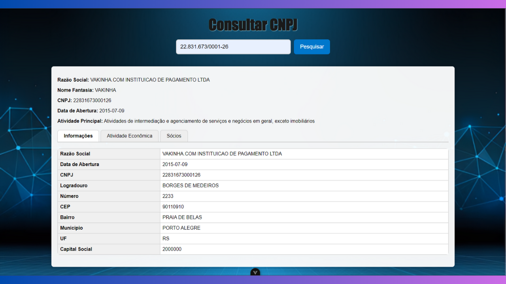
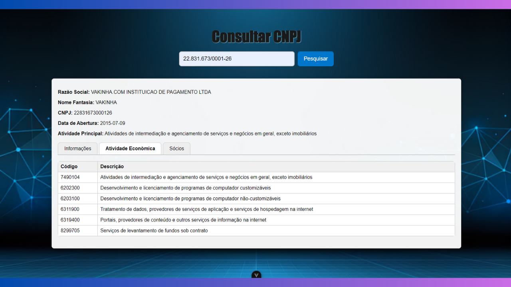

# 📊 Consulta CNPJ

Desafio Fullstack Finalizado!

Aplicação **frontend** desenvolvida em **Vue 3 + Vite** para consulta de CNPJs, exibindo informações completas da empresa, incluindo **dados cadastrais, atividades econômicas e sócios**.

---

## ✨ Funcionalidades

✅ Consulta de CNPJ em tempo real  
✅ Exibição dos dados principais da empresa  
✅ Informações sobre atividades econômicas  
✅ Lista de sócios

---

## 🖼️ Demonstração do Projeto

### 📌 Informações da Empresa

---

### 📌 Atividade Econômica

---

### 📌 Sócios

---

⚙️ Como rodar o projeto
1️⃣ Backend (Laravel)
cd backend-cnpj
composer install
php artisan serve

O backend estará rodando em:
👉 http://127.0.0.1:8000

2️⃣ Frontend (Vite)
cd frontend-cnpj
npm install
npm run dev

O frontend estará rodando em:
👉 http://localhost:5173

✅ Histórico e Revisões
O que foi feito inicialmente

Frontend implementado com HTML, CSS e JS puro.

Estrutura de abas para exibir Informações, Atividade Econômica e Sócios.

Consulta de CNPJs funcionando via fetch, mas o frontend chamava diretamente a API Brasil, sem passar por backend.

Referência do projeto mencionava Vue 3, mas a implementação estava em JS puro.

⚠️ O que estava faltando

Backend intermediário em PHP/Laravel que recebe o CNPJ do frontend, consulta a API Brasil e retorna os dados tratados.

Configuração de CORS para permitir chamadas entre frontend (Vite) e backend (Laravel).

Endpoint /api/cnpj que retorna todos os dados necessários (informações principais, atividades e sócios).

✅ O que foi corrigido e implementado

Criação do backend em Laravel 11.

Endpoint /api/cnpj implementado no CnpjController que:

Recebe o CNPJ do frontend.

Consulta a BrasilAPI.

Retorna os dados tratados em JSON para o frontend.

Configuração do CORS para permitir requisições do frontend em http://localhost:5173.

Frontend atualizado para consumir o backend corretamente.

Testes realizados confirmando que todos os dados aparecem corretamente, incluindo:

Razão social e nome fantasia

Endereço completo

Capital social

Atividade econômica principal e secundária

Sócios com CPF/CNPJ e cargos

👩‍💻 Desenvolvedora

Feito com 💙 por Mary Hunter
🔗 GitHub
